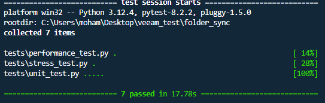

# folder_sync - Folder Synchronization
This script performs one-way synchronization between a source folder and a replica folder. It periodically updates the replica folder to match the source folder, logging file operations to a specified log file and the console.

## Getting Started

Clone the repository to your local machine:

```bash
git clone https://github.com/Mohaamedl/folder_sync.git
cd folder_sync
```

## Environment Setup (optional)

It is recommended to use a virtual environment to isolate project dependencies. Follow these steps to set up the virtual environment:


### Creating a Virtual Environment with venv

```bash
python -m venv venv

```
Activating the Virtual Environment:

On Linux/Mac:
```bash
source venv/bin/activate

```

On Windows:

```bash
venv\Scripts\activate

```
### Creating a Virtual Environment with Conda
If you are using Anaconda or Miniconda:
```bash
conda create --name myenv 
```
and activate:
```bash
conda activate myenv

```


## Installing Dependencies
To install the required dependencies, you can use various package management tools depending on your setup:
### Using pip
```bash
pip install -r requirements.txt
```
### Using Conda

```bash
conda install --file requirements.txt

```
## Usage

```bash
python folder_sync.py <source_folder> <replica_folder> <interval_in_seconds> <log_file>
```

Arguments

- <source_folder>: Path to the source folder.

- <replica_folder>: Path to the replica folder.

- <interval_in_seconds>: Interval in seconds between synchronization checks.

- <log_file>: Path to the log file.


## Running Tests

### All Tests
To run all tests using pytest, navigate to your project directory and execute:
```
pytest

```
You should see output similar to the following (the exact time may vary based on your machine):
<p align="center">
  
</p>


Alternatively, you can execute each test individually. Here are some examples: 
``` 
# Run performance test and save results to log file
pytest tests/performance_test.py > tests/performance_test_results.log

# Run unit tests
pytest tests/unit_tests.py > tests/unit_test_results.log

# Run stress test
pytest tests/stress_test.py > tests/stress_test_results.log


```
## Test Types

- Performance Test: Evaluates the performance of the synchronization process under load, measuring factors like file creation, synchronization time, and resource usage.

- Unit Tests: Ensures individual units (functions, methods) of the codebase work correctly in isolation.

- Stress Test: Checks the robustness and stability of the synchronization process under high load or adverse conditions.

## Requirements
- Python 3.6 or higher
- Packages listed in requirements.txt
